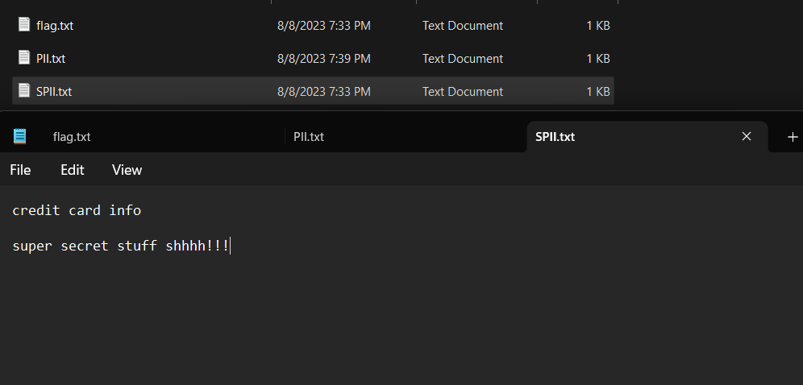
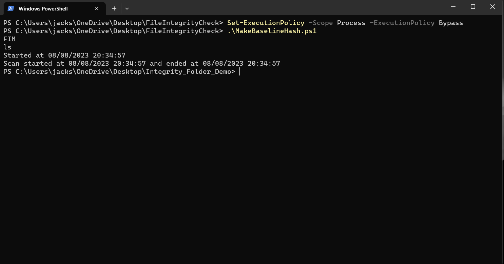
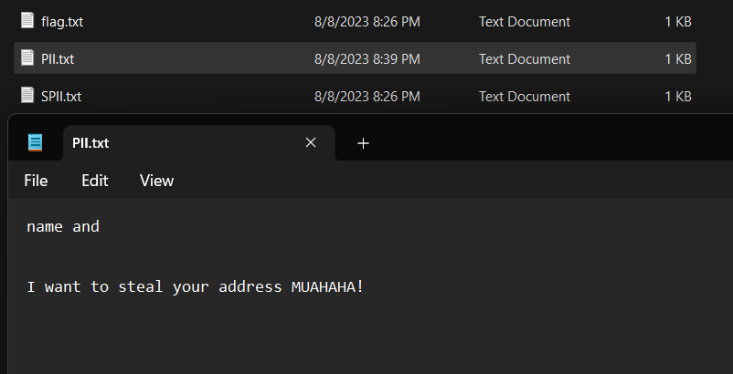

<h1>File Integrity Monitor</h1>
 

 
<h2>Description</h2>
A File Integrity Monitor using PowerShell is a script that continuously compares the hash values of files against a baseline, alerting administrators to unauthorized changes. It helps maintain data integrity and detect potential security breaches.
 

<h2>Languages and Utilities Used</h2>

- <b>PowerShell</b> 

<h2>Environments Used </h2>

- <b>Windows 10 / Windows 11</b> 

<h2>Program walk-through:</h2>

Launch the utility:  

 Everything needed for the File Integrity Check:   

 
 

Targeting Folder with valuable information:   

 
 

Run the MakeBaselineHash to get the original untampered hashes of files:   

 
 

Baseline hashes:   

 
 

Perpetrator goes into the system and steals your address without consent:   

 
 

Run the CheckFileIntegrity command and check what files have been altered:   

 
 

The previous command shows that the "PII.txt"'s hash has been changed and was notified:   

 
 

Inspired by Zach 
